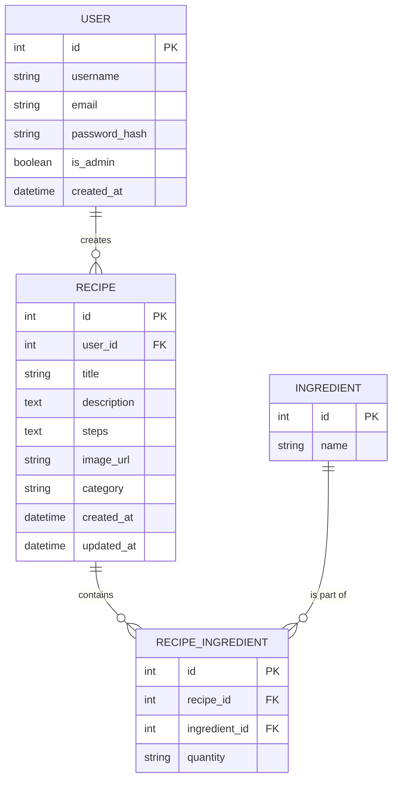

# 資料庫設計文件

本文件描述食譜收藏夾系統的資料庫定義，包含實體關係圖（ER 圖）與各資料表的詳細欄位說明。

## 1. ER 圖（實體關係圖）

## 2. 資料表詳細說明

### USER (使用者)
| 欄位名稱 | 型別 | 必填 | 說明 |
| :--- | :--- | :--- | :--- |
| `id` | INTEGER | 是 | Primary Key, 自動遞增 |
| `username` | TEXT | 是 | 使用者名稱 |
| `email` | TEXT | 是 | 信箱 (唯一值) |
| `password_hash` | TEXT | 是 | 密碼雜湊值 |
| `is_admin` | INTEGER | 否 | 是否為管理員 (預設 0 代表否，1 代表是) |
| `created_at` | TEXT | 是 | 建立時間 (ISO Format JSON 格式存放) |

### RECIPE (食譜)
| 欄位名稱 | 型別 | 必填 | 說明 |
| :--- | :--- | :--- | :--- |
| `id` | INTEGER | 是 | Primary Key, 自動遞增 |
| `user_id` | INTEGER | 是 | Foreign Key 關聯至 USER.id |
| `title` | TEXT | 是 | 食譜標題 |
| `description`| TEXT | 否 | 食譜簡介說明 |
| `steps` | TEXT | 是 | 料理步驟 |
| `image_url` | TEXT | 否 | 圖片檔案路徑或網址 |
| `category` | TEXT | 否 | 食譜分類標籤 (如：台式、甜點) |
| `created_at` | TEXT | 是 | 建立時間 (ISO Format) |
| `updated_at` | TEXT | 是 | 最後更新時間 (ISO Format) |

### INGREDIENT (食材)
| 欄位名稱 | 型別 | 必填 | 說明 |
| :--- | :--- | :--- | :--- |
| `id` | INTEGER | 是 | Primary Key, 自動遞增 |
| `name` | TEXT | 是 | 食材名稱 (唯一值) |

### RECIPE_INGREDIENT (食譜與食材關聯表)
| 欄位名稱 | 型別 | 必填 | 說明 |
| :--- | :--- | :--- | :--- |
| `id` | INTEGER | 是 | Primary Key, 自動遞增 |
| `recipe_id` | INTEGER | 是 | Foreign Key 關聯至 RECIPE.id |
| `ingredient_id`| INTEGER | 是 | Foreign Key 關聯至 INGREDIENT.id |
| `quantity` | TEXT | 否 | 數量或份量 (如 "100g", "2顆") |
