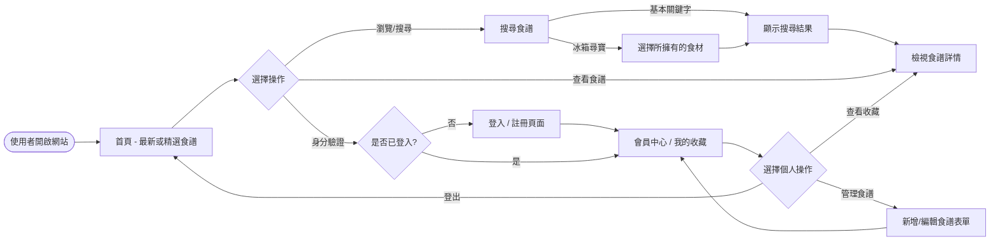
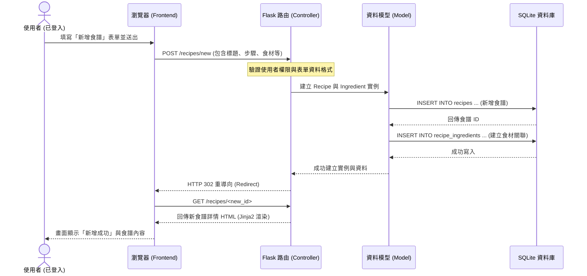

# 流程圖：食譜收藏夾

本文件基於 PRD（產品需求文件）與系統架構，透過視覺化圖表描述使用者的核心操作路徑，以及伺服器端的資料交換流程。

## 1. 使用者流程圖（User Flow）

此流程圖展示一般使用者在進入網站後，可以進行的各項主要操作與頁面跳轉邏輯。

---

## 2. 系統序列圖（Sequence Diagram）

以下序列圖以核心功能**「新增食譜」**為例，描述從使用者填寫表單到資料寫入 SQLite 資料庫的完整系統互動過程。

---

## 3. 功能清單對照表

以 RESTful API 的風格規劃對應各功能的網址 (URL) 行為，方便未來進行路由 (`routes/`) 實作。

| 功能區塊 | 操作目標 | URL 網址路徑 | HTTP 方法 | 說明 |
| :--- | :--- | :--- | :--- | :--- |
| **首頁** | 顯示預設頁面 | `/` | GET | 網站進入點，顯示推薦清單或簡介 |
| **會員管理** | 使用者註冊 | `/auth/register` | GET, POST | GET 顯示表單；POST 處理註冊邏輯 |
| | 使用者登入 | `/auth/login` | GET, POST | GET 顯示表單；POST 處理登入邏輯 |
| | 使用者登出 | `/auth/logout` | GET | 執行登出並清除 Session |
| **食譜管理** | 瀏覽食譜總覽 | `/recipes` | GET | 列出系統內的所有/公開食譜 |
| | 新增食譜 | `/recipes/new` | GET, POST | GET 顯示表單；POST 執行資料庫寫入 |
| | 查看單一食譜 | `/recipes/<id>` | GET | 根據特定 ID 顯示食譜詳細網頁 |
| | 編輯食譜 | `/recipes/<id>/edit` | GET, POST | GET 顯示舊資料；POST 更新資料庫 |
| | 刪除食譜 | `/recipes/<id>/delete`| POST | 執行資料刪除，避免使用 GET 防誤觸 |
| **特色搜尋** | 冰箱尋寶(食材搜尋)| `/search` | GET | 提交多個食材的 Query 字串進行搜尋 |
| **管理後台** | 管理員儀表板 | `/admin/dashboard`| GET | 僅限具備管理員權限者存取 |

